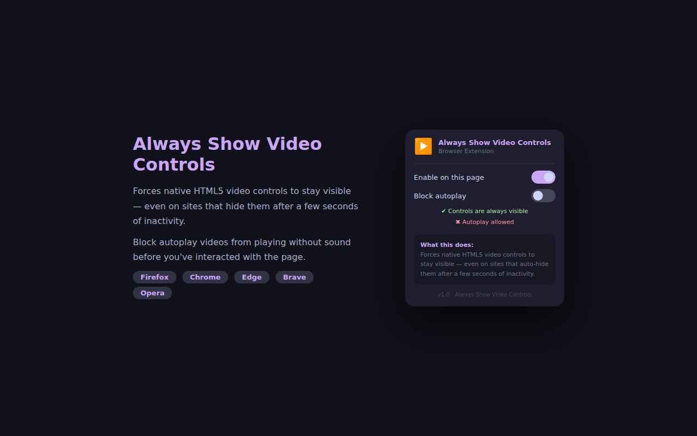

# Always Show Video Controls
this extension has been entirely vibe coded with Free claude.ai opus 4.6

A browser extension that keeps native HTML5 video controls permanently visible and blocks autoplay — on any website, without any configuration.



---

## Features

### Always show controls
Many websites hide the native video control bar after a few seconds of inactivity, forcing you to wave your mouse around to get it back. This extension counteracts that by:

- Forcing the `controls` attribute to remain on every `<video>` element
- Overriding Firefox and Chromium shadow DOM pseudo-elements via CSS (`-moz-media-controls`, `-webkit-media-controls`) with `!important`
- Using a `MutationObserver` to catch and reverse any JavaScript that removes the attribute dynamically
- Running in all frames (`all_frames: true`) so embedded iframes and players are covered too

### Block autoplay
Sites autoplay videos — often muted, to bypass the browser's own autoplay policy — before you have chosen to watch anything. This toggle:

- Removes the `autoplay` attribute before the browser can act on it
- Also removes `muted`, so when **you** press play, the video starts with sound
- Intercepts `HTMLMediaElement.prototype.play()` and suppresses calls that arrive without a real user gesture, detected via `navigator.userActivation.isActive`
- Watches for sites that add `autoplay` or `muted` back via JavaScript and removes them again
- Once you explicitly press play on a video, that video is permanently released — the extension never interferes with your deliberate choices again

Both features are independent toggles. Changes take effect immediately on the current tab without a page reload.

---

## Browser support

| Browser | Install |
|---|---|
| Firefox | [Firefox Add-ons (AMO)]() link will be publish if accepted.|
| Chrome | Take the release or clone this repo, i refuse to pay fee to publish extension  (i don't like chromium browser)|
| Edge | same |
| Brave | same |
| Opera | not tested, probably same thing |

---

## Installation from source

```bash
git clone https://github.com/Moubai/always-show-video-controls.git
cd always-show-video-controls
```

**Firefox**

1. Go to `about:debugging#/runtime/this-firefox`
2. Click **Load Temporary Add-on**
3. Select `manifest.json` from the `extension-firefox/` folder

Or install the signed `.xpi` from the [Releases](https://github.com/Moubai/always-show-video-controls/releases) page.

**Chrome / Edge / Brave / Opera**

1. Go to `chrome://extensions` (or the equivalent in your browser)
2. Enable **Developer mode**
3. Click **Load unpacked**
4. Select the `extension-chromium/` folder

---

## Project structure

```
always-show-video-controls/
├── extension-firefox/          # Firefox package (MV3, gecko-specific settings)
│   ├── manifest.json
│   ├── content.js
│   ├── popup.html
│   ├── popup.js
│   ├── video-controls.css
│   ├── icons/
│   └── _locales/               # 11 languages
│       ├── en/
|       ├── fr/
|       ├── ar/
|       ├── es/
│       ├── pt_BR/
|       ├── ru/
|       ├── zh_CN/
│       ├── ja/
|       ├── hi/
|       ├── bn/
|       ├── ur/
├── extension-chromium/         # Chromium package (MV3, host_permissions)
│   └── ...                     # Same files, different manifest.json
└── docs/
    ├── PRIVACY.md
    ├── STORE_DESCRIPTIONS.md
    ├── store_screenshot.png
    └── popup_screenshot.png
```

---

## How it works

### Controls visibility

The extension uses two complementary layers:

**CSS layer** — `video-controls.css` targets the browser's own shadow DOM pseudo-elements that render the native control bar. Both the Firefox (`-moz-media-controls`) and Chromium (`-webkit-media-controls`) variants are covered. All rules use `!important` and `transition: none` to prevent fade-out animations.

**JavaScript layer** — `content.js` runs at `document_start` so it executes before the page's own scripts. It adds the `controls` attribute to every `<video>` and attaches a `MutationObserver` per element to restore it if removed.

### Autoplay blocking

The script patches `HTMLMediaElement.prototype.play` at injection time, before any site code can run. The interceptor checks `navigator.userActivation.isActive` — a browser-native signal that is `true` only within the same task as a real user gesture. Calls without that signal are suppressed and return `Promise.resolve()` so sites that do `.play().catch(...)` do not throw.

A per-video `WeakSet` (`userReleasedVideos`) tracks videos the user has explicitly started. Once a video is in that set, every check is bypassed — no interference ever again.

### Browser API compatibility

Both `content.js` and `popup.js` open with:

```js
const api = (typeof browser !== 'undefined') ? browser : chrome;
```

This single line makes the codebase work on Firefox (which exposes `browser`) and all Chromium-based browsers (which expose `chrome`) without any build step or bundler.

---

## Permissions

| Permission | Why |
|---|---|
| `storage` | Saves your toggle preferences locally. Never leaves your device. |
| `activeTab` | Lets the popup send a message to the current tab when you flip a toggle, so changes apply without a reload. |
| `<all_urls>` | HTML5 videos appear on any domain. A static list of sites would be incomplete and impossible to maintain. The content script reads no page content and makes no network requests. |

---

## Localization

The extension ships with 11 languages:

English · French · Spanish · Portuguese (Brazil) · Russian · Arabic · Urdu · Hindi · Bengali · Chinese (Simplified) · Japanese

RTL layouts (Arabic, Urdu) are handled automatically — the popup sets `dir="rtl"` based on the browser's UI language.

To add a new language, create `_locales/<locale>/messages.json` following the structure in `_locales/en/messages.json` and open a pull request.

---

## Privacy

No data is collected, stored remotely, or transmitted. See [PRIVACY.md](docs/PRIVACY.md) for the full policy.

---

## License

MIT — see [LICENSE](LICENSE)

---

## Contributing

Issues and pull requests are welcome at https://github.com/Moubai/always-show-video-controls
